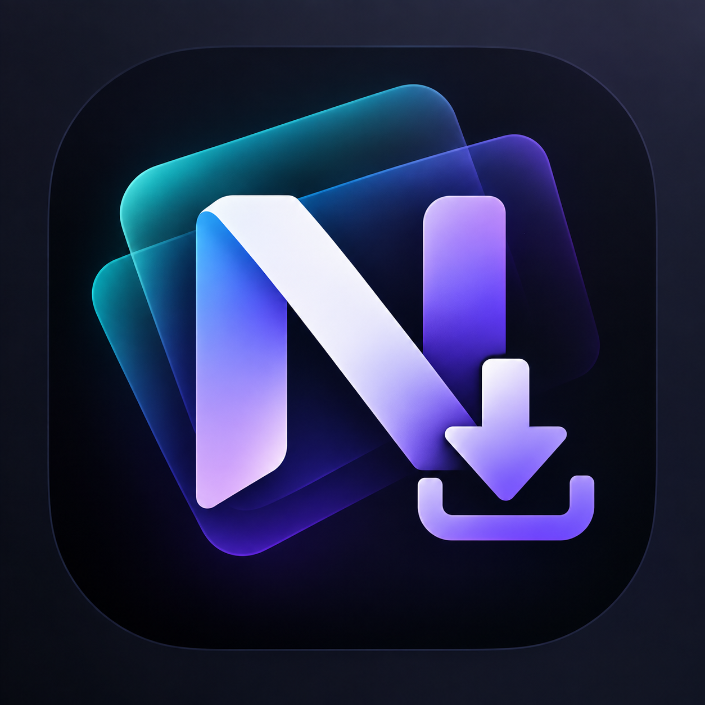

# NicheLoader



Yet another on-device codesigning app for iOS, by mintoo.

## What is this?
NicheLoader lets you sign and install `.ipa` files directly on your iPhone or iPad using your own signing certificate (`.p12` + `.mobileprovision`). No computer, no jailbreak, no paid certificate required to get started.

Features:
- Sign apps on-device with your own certificate
- Inject tweaks, dylibs and frameworks
- Bulk signing for multiple apps
- Built-in file manager with plist and text editor
- Built-in downloads with background support
- App library with install management
- AltStore sources for browsing apps

## Download
Go to [Releases](https://github.com/noname7821/NicheLoaderr/releases) and download the newest `NicheLoader.ipa` from there.

You can also add this AltStore source to your favourite installer:

```
https://raw.githubusercontent.com/noname7821/NicheLoaderr/refs/heads/main/repo.json
```

## Screenshots
Screenshots of NicheLoader will be added here soon.

<!--
Add your screenshots to the `screenshots/` folder and reference them here:


-->

## Credits
- Solo Developer: [mintoo](https://github.com/noname7821)
- NicheLoader is a fork of [Ksign](https://github.com/Nyasami/Ksign) by Nyasami, which itself is based on [Feather](https://github.com/khcrysalis/Feather) by khcrysalis. All signing functionality is based on their work.

## Help
Open an [Issue](https://github.com/noname7821/NicheLoaderr/issues) for bugs or feature requests.

## Disclaimer
This project is maintained here, on GitHub. Releases are distributed here, on GitHub. Avoid sites that re-host this software, they are often malicious.
